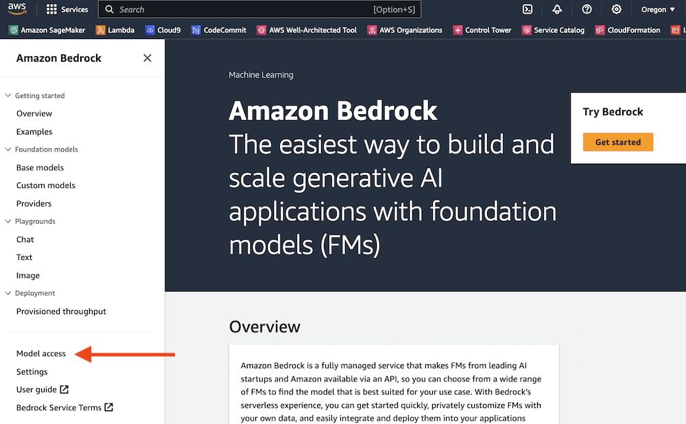

# Gen AI Workshop with DoiT International

This workshop is aimed to give you an introduction hands-on experience with Bedrock, Langchain, and Streamlit.

* **Bedrock** - Fully mnanage service that offers high-performing foundational models from leading AI companies such as AI21 Labs, Anthropic, Cohere, Meta, Mistral AI, Stability AI, and Amazon through a single API.

    * **Knowledgebase**: Managed document retrieval service for RAG architecture. The service leverages OpenSearch Servelerss or Aurora Postgress Serverless with embedding models to deliver a robust solution.

    * **Agents**: Managed service to integrate GenAI workflows with any other system to enhance the experience by allowing custom actions based on specific situations.

    * **Model Evaluation**: Evaluate models againsta a specific set of prompts or a custom prompt dataset. This allows to continously understand the quality of the models againsts specific knoeledge domains.

 

* **langchain** - Is a framework for developing applications powered by language models. It enables applications that:

    * **Are context-aware**: connect a language model to sources of context (prompt instructions, few shot examples, content to ground its response in, etc.)
    * **Reason**: rely on a language model to reason (about how to answer based on provided context, what actions to take, etc.)

 

* **streamlit** - Streamlit is an open-source Python library that makes it easy to create and share beautiful, custom web apps for machine learning and data science.

## Getting started

### Amazon Bedrock Setup

We will be using Amazon Bedrock  to access foundation models in this workshop.

Below we will configure model access in Amazon Bedrock in order to build and run generative AI applications. Amazon Bedrock provides a variety of foundation models from several providers.

1. Find Amazon Bedrock by searching in the AWS console.

2. Expand the side menu.

3. From the side menu, select Model access.

4. Select the Manage model access button.

5. Select the checkboxes listed below to activate the models. If running from your own account, there is no cost to activate the models - you only pay for what you use during the labs. Review the applicable EULAs as needed.

* AI21 > Jurassic-2 Ultra
* Amazon (select Amazon to automatically select all Amazon Titan models)
* Anthropic > Claude
* Cohere > Command
* Meta > Llama 2 Chat 13B
* Stability AI > SDXL 1.0

Click **Request model access** to activate the models in your account.

6. Monitor the model access status. It may take a few minutes for the models to move from **In Progress** to **Access granted** status. You can use the Refresh button to periodically check for updates.

7. Verify that the model access status is **Access granted** for the previously selected models.

### AWS Cloud9 setup

We will be using AWS Cloud9  as our integrated development environment for this workshop. AWS Cloud9 is one option for building applications with Amazon Bedrock - you can also use your own development tools (VS Code, PyCharm, etc.), Amazon SageMaker Studio , or Jupyter Notebooks.

Below we will configure an AWS Cloud9 enviroment  in order to build and run generative AI applications. An environment is a web-based integrated development environment for editing code and running terminal commands.

**Assumptions for the following instructions**

* AWS Cloud9 will be run from the same account and region where Bedrock foundation models have been enabled.

* The acccount and region have a default VPC configured (this is the AWS default).

If you have any challenges below, you may need to access Bedrock from your desktop environment, or create an alte

### Lab setup

1. Clone the repo to your local environment

2. Install Requirements

        conda create -n "bedrock-workshop" python=3.10
        conda activate bedrock-workshop
        pip install -r requirements.txt

### Workshop

There are two folders in this repo:

* **completed**: This contains all labs with all the code ready to be run. The Readme will provide you insight into what the code is doing.

* **hands-on**: This contains the files required but without any code. The Readme will guide you on adding each code piece.

## Remember Have Fun!