# Lab Intro

In this lab, we will build a simple question & answer application with AI21 Jurassic 2, Titan Embeddings, LangChain, and Streamlit.

Large language models are prone to hallucination, which is just a fancy word for making up a response. To correctly and consistently answer questions, we need to ensure that the model has real information available to support its responses. We use the Retrieval-Augmented Generation (RAG) pattern to make this happen.

With Retrieval-Augmented Generation, we first pass a user's prompt to a data store. This might be in the form of a query to Amazon Kendra . We could also create a numerical representation of the prompt using Amazon Titan Embeddings to pass to a vector database. We then retrieve the most relevant content from the data store to support the large language model's response.

In this lab, we will use an in-memory FAISS  database to demonstrate the RAG pattern. In a real-world scenario, you will most likely want to use a persistent data store like Amazon Kendra or the vector engine for Amazon OpenSearch Serverless .

You can build the application code by copying the code snippets below and pasting into the indicated Python file.

### Use cases

The Retrieval-Augmented Generation pattern is good for the following use cases:

* Question & answer, supported by specialized knowledge or data
* Intelligent search

1. A document is broken up into chunks of text. The chunks are passed to Titan Embeddings to be converted to vectors. The vectors are then saved to the vector database.
2. The user submits a question.
3. The question is converted to a vector using Amazon Titan Embeddings, then matched to the closest vectors in the vector database.
4. The combined content from the matching vectors + the original question are then passed to the large language model to get the best answer.

This application consists of two files: one for the Streamlit front end, and one for the supporting library to make calls to Bedrock.

There is a third file to help upload sample documents to s3 to be used by the knoweldge base.

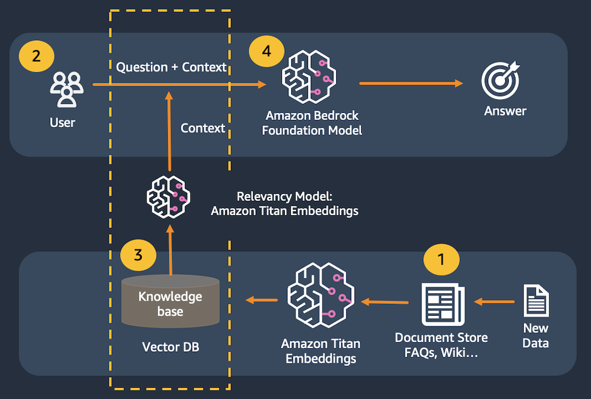

### Create the upload files script

1. Open the file get_data.py

        

2. Add the import statements
    * These statements allow the creation of a folder, download the files, and upload them to s3

            import json
            import os
            import boto3
            import os

3. Create a folder to hold the files
    * If the folder already exists it will error out, but the script will continue

            try:
                os.mkdir("data")
            except:
                print("Directory already exists")

4. Set the required variables to connect and upload files to s3
    * Combine the current AS region and account number to create a unique S3 bucket name

            sts_client = boto3.client('sts')
            boto3_session = boto3.session.Session()
            region_name = boto3_session.region_name
            s3_client = boto3.client('s3')
            account_id = sts_client.get_caller_identity()["Account"]
            s3_suffix = f"{region_name}-{account_id}"
            bucket_name = f'bedrock-kb-{s3_suffix}-oincd'   

5. Create the s3 bucket
    * Prints a message if the bucket already exists

            try:
                s3bucket = s3_client.create_bucket(
                    Bucket=bucket_name,
                    CreateBucketConfiguration={ 'LocationConstraint': region_name }
                )
            except:
                print("Bucket already exists")     

6. Download and prepare the dataset
    * Files are saved to the data folder

            from urllib.request import urlretrieve
            urls = [
                'https://s2.q4cdn.com/299287126/files/doc_financials/2023/ar/2022-Shareholder-Letter.pdf',
                'https://s2.q4cdn.com/299287126/files/doc_financials/2022/ar/2021-Shareholder-Letter.pdf',
                'https://s2.q4cdn.com/299287126/files/doc_financials/2021/ar/Amazon-2020-Shareholder-Letter-and-1997-Shareholder-Letter.pdf',
                'https://s2.q4cdn.com/299287126/files/doc_financials/2020/ar/2019-Shareholder-Letter.pdf'
            ]

            filenames = [
                'AMZN-2022-Shareholder-Letter.pdf',
                'AMZN-2021-Shareholder-Letter.pdf',
                'AMZN-2020-Shareholder-Letter.pdf',
                'AMZN-2019-Shareholder-Letter.pdf'
            ]

            data_root = "./data/"

            for idx, url in enumerate(urls):
                file_path = data_root + filenames[idx]
                urlretrieve(url, file_path)       

7. Upload data to s3
    * Files will be overwritten if alredy exists

            s3_client = boto3.client("s3")
            def uploadDirectory(path,bucket_name):
                    for root,dirs,files in os.walk(path):
                        for file in files:
                            s3_client.upload_file(os.path.join(root,file),bucket_name,file)

            uploadDirectory(data_root, bucket_name)

### Create a knowledge base

We will create a opensearch knowledge base through the ui to convert the documents to embeddigns and store them in opensearch as vectors.

1. In the console go to Bedrock service and click on **Knowledge base** on the left menu

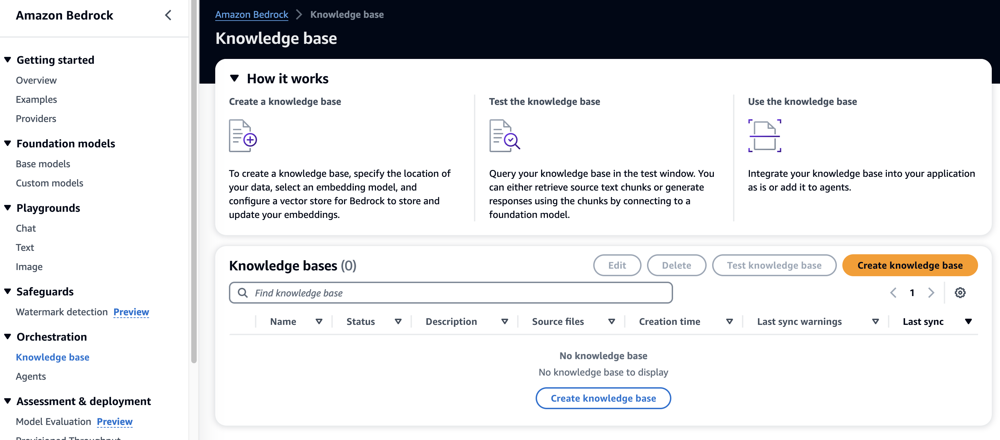

2. Click on **Create knowledge base**
 
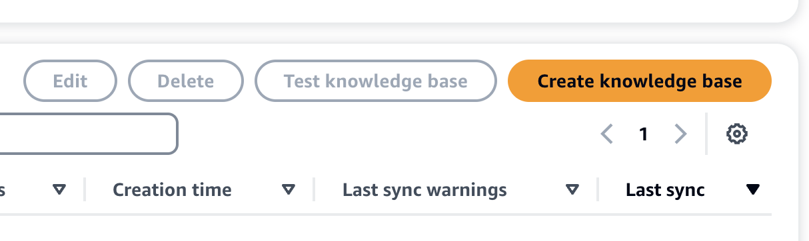

3. Leave the default values as is and click next

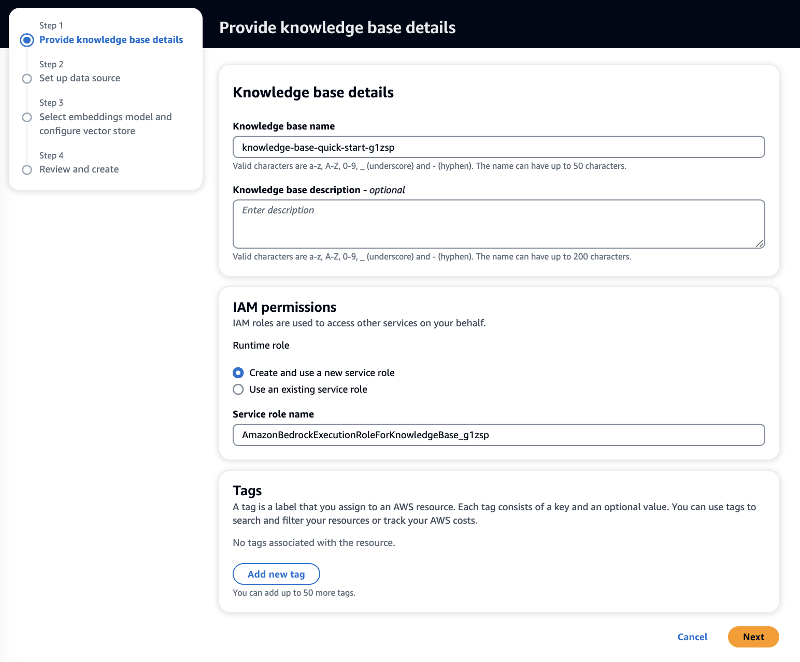

4. Click on Browse S3

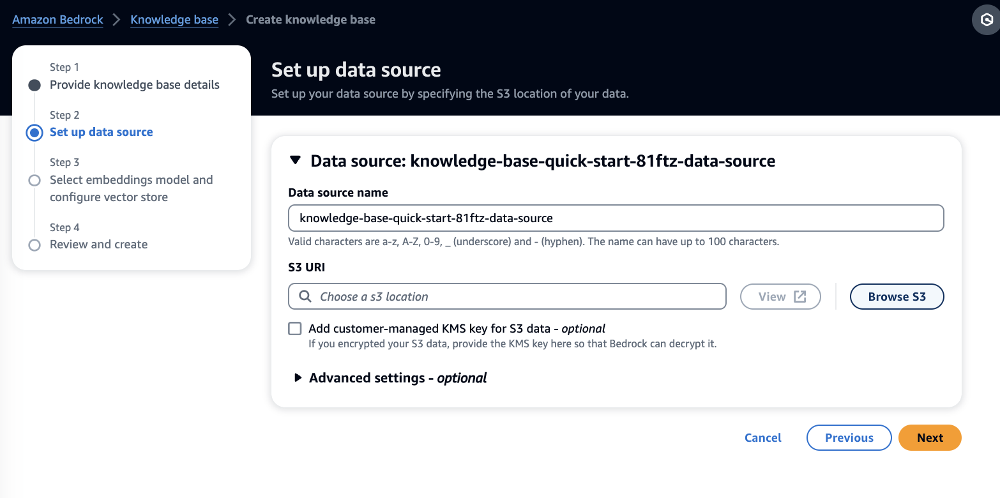 

5. In the new poop=up search for **bedrock** and select the bucket. The name should start with **bedrock-kb-**

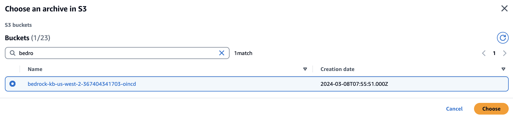

6. Click next

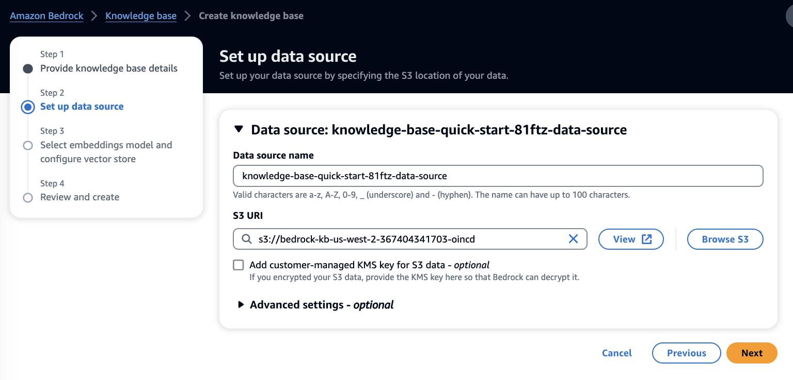 

7. Select Titan for then embedding model and next next

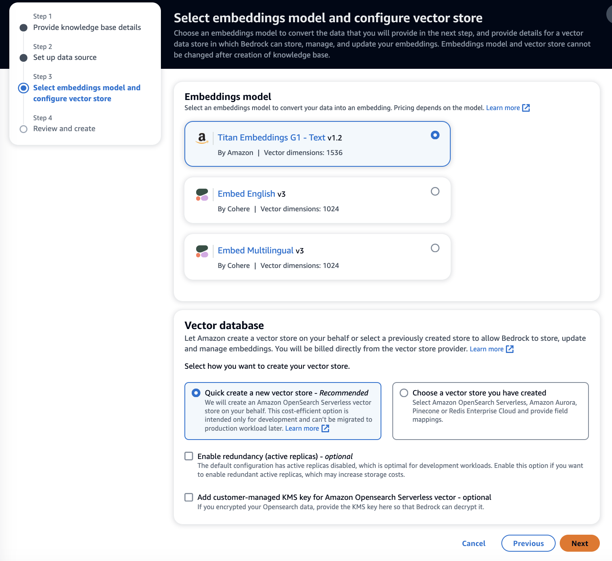

8. Review the values and then click next
    * The creation of the knowledge base may take a few minutes.

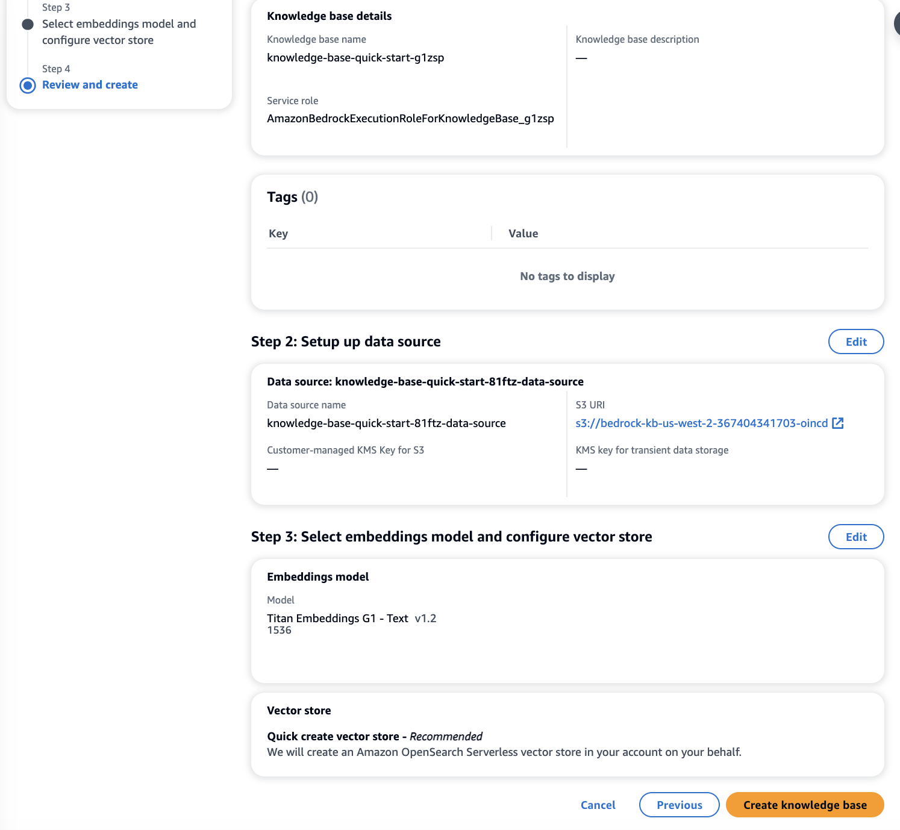 

9. Sync the documents with the knowledge base

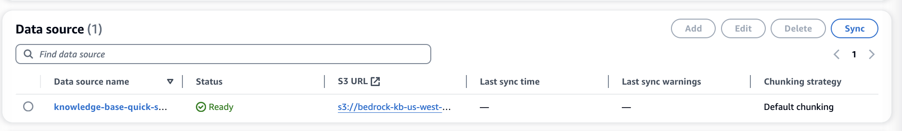 
    

### Create app library file

We will create the supporting library to connect the Streamlit front end to the Bedrock back end.

1. Open the file rag_lib.py

2. Add the import statements.

    * These statements allow us to use LangChain to load a PDF file, index the document, and call Bedrock.

            import os
            from langchain.embeddings import BedrockEmbeddings
            from langchain.indexes import VectorstoreIndexCreator
            from langchain.vectorstores import FAISS
            from langchain.text_splitter import RecursiveCharacterTextSplitter
            from langchain.document_loaders import PyPDFLoader
            from langchain.llms.bedrock import Bedrock
            
3. Add a function to create a Bedrock LangChain client.

    * This includes the inference parameters we want to use.
    
            def get_llm():
                
                model_kwargs = { #AI21
                    "maxTokens": 1024, 
                    "temperature": 0, 
                    "topP": 0.5, 
                    "stopSequences": [], 
                    "countPenalty": {"scale": 0 }, 
                    "presencePenalty": {"scale": 0 }, 
                    "frequencyPenalty": {"scale": 0 } 
                }
                
                llm = Bedrock(
                    credentials_profile_name=os.environ.get("BWB_PROFILE_NAME"), #sets the profile name to use for AWS credentials (if not the default)
                    region_name=os.environ.get("BWB_REGION_NAME"), #sets the region name (if not the default)
                    endpoint_url=os.environ.get("BWB_ENDPOINT_URL"), #sets the endpoint URL (if necessary)
                    model_id="ai21.j2-ultra-v1", #set the foundation model
                    model_kwargs=model_kwargs) #configure the properties for Claude
                
                return llm
            
4. Add the function to connect to the knowedge base
    * Replace the knowledgebase id with the id from the knowledge in the console

            def get_retriever():
                retriever = AmazonKnowledgeBasesRetriever(
                    knowledge_base_id="<Knowledgebase id>",
                    retrieval_config={"vectorSearchConfiguration": {"numberOfResults": 4}},
                )
                
                return retriever
                
5. Add this function to call Bedrock.

    * This code searches the previously created index based on the user's input, adds the best matches to a prompt along with the user's text, and then sends the combined prompt to the model.
    
    def get_rag_response(index, question): #rag client function
    
        llm = get_llm()
        
        response_text = index.query(question=question, llm=llm) #search against the in-memory index, stuff results into a prompt and send to the llm
        
        return response_text
        
6. Save the file.

Excellent! You are done with the backing library. Now we will create the front-end application.

### Crate the Streamlit front-end app

1. In the same folder as your lib file, open the file rag_app.py
 
2. Add the import statements.
    * These statements allow us to use Streamlit elements and call functions in the backing library script.

            import streamlit as st #all streamlit commands will be available through the "st" alias
            import rag_lib as glib #reference to local lib script

3. Add the page title and configuration.
    * Here we are setting the page title on the actual page and the title shown in the browser tab.
    
            st.set_page_config(page_title="Retrieval-Augmented Generation") #HTML title
            st.title("Retrieval-Augmented Generation") #page title

            
4. Add the input elements.
    * We are creating a multiline text box and button to get the user's prompt and send it to Bedrock.
    
            input_text = st.text_area("Input text", label_visibility="collapsed") #display a multiline text box with no label
            go_button = st.button("Go", type="primary") #display a primary button

5. Add the output elements.

    * We use the if block below to handle the button click. We display a spinner while the backing function is called, then write the output to the web page.
    
            if go_button: #code in this if block will be run when the button is clicked
    
                with st.spinner("Working..."): #show a spinner while the code in this with block runs
                    response_content = glib.get_rag_response(question=input_text) #call the model through the supporting library
                    
                    st.write(response_content) #display the response content

Save the file.
Superb! Now you are ready to run the application!

1. Select the bash terminal in AWS Cloud9 and change directory.

        cd ~/environment/aws-genai-workshop/completed/lab1
        
2. Run the streamlit command from the terminal.

        streamlit run rag_app.py --server.port 8080

Ignore the Network URL and External URL links displayed by the Streamlit command. Instead, we will use AWS Cloud9's preview feature.

 
3. In AWS Cloud9, select Preview -> Preview Running Application.

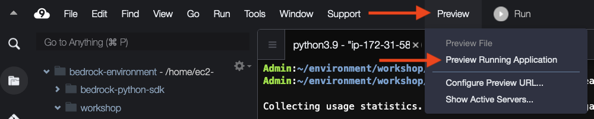 

You should see a web page like below:

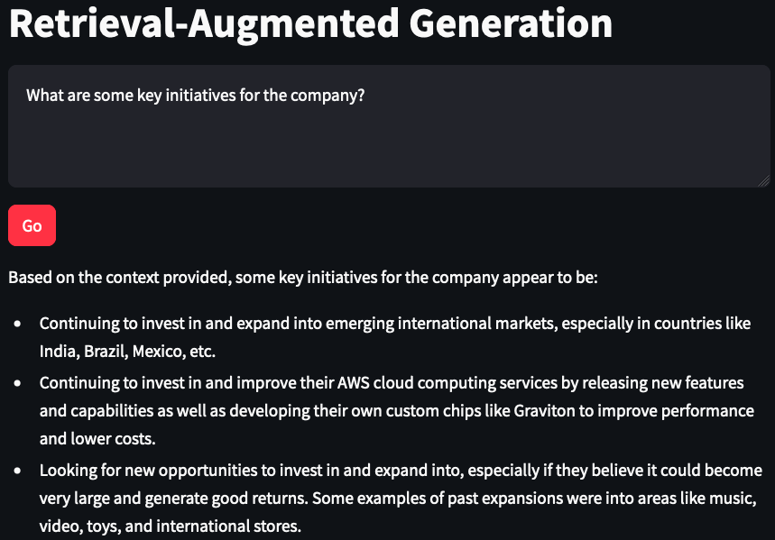 

4. Try out some prompts and see the results:

* What are some of the current strategic initiatives for the company?
* What is the company's strategy for generative AI?
* What are the key growth drivers for the company?
* ¿Cuáles son algunas de las iniciativas estratégicas actuales de la empresa?* 
* Quelle est la stratégie de l'entreprise en matière d'IA générative ?
* Was sind die wichtigsten Wachstumstreiber für das Unternehmen? 

5. Close the preview tab in AWS Cloud9. Return to the terminal and press Control-C to exit the application.

