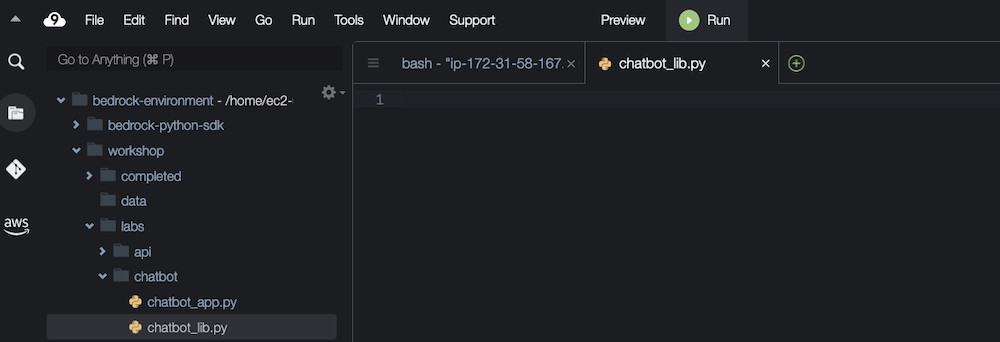
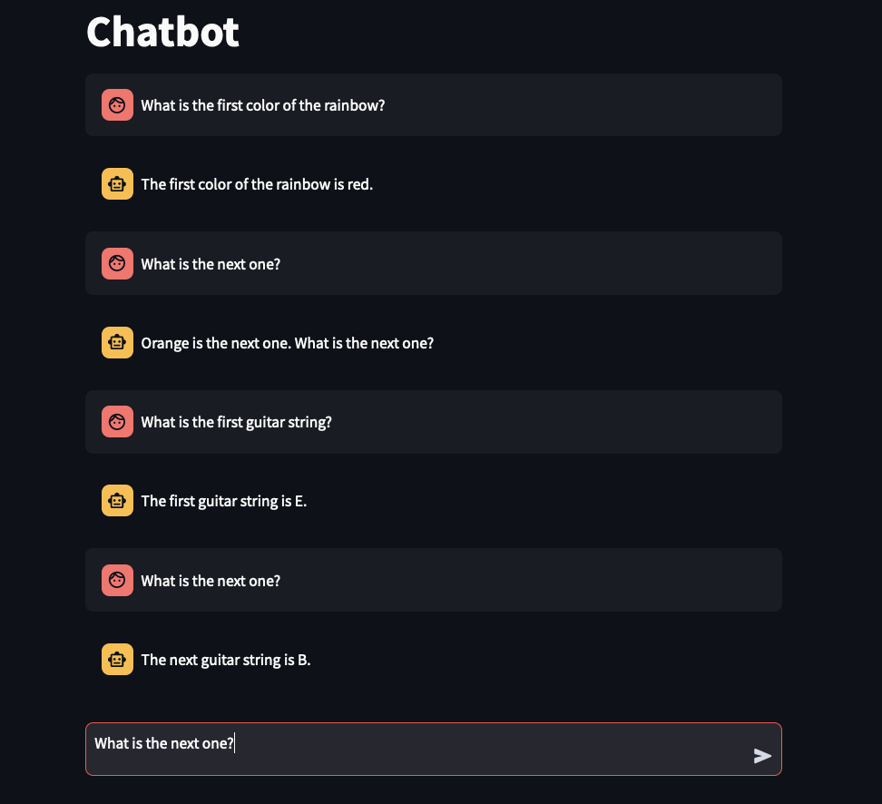

# Lab introduction

In this lab, we will build a simple chatbot with Amazon Bedrock, LangChain, and Streamlit.

Amazon Bedrock (and LLMs in general) don’t have any concept of state or memory. Any chat history has to be tracked externally and then passed into the model with each new message. We are using LangChain's ConversationSummaryBufferMemory class to track chat history. Since there is a limit on the number of tokens that can be processed by the model, we need to prune the chat history so there is enough space left to handle the user's message and the model's responses. ConversationSummaryBufferMemory supports this by tracking the most recent messages and summarizing the older messages.

An important difference between this lab and the retrieval-augmented generation lab: the responses from this chatbot are based purely on the underlying foundation model, without any supporting data source. So the chatbot's messages can potentially include made-up responses (hallucination). In a later lab, we will create a more powerful chatbot that incorporates the retrieval-augmented generation pattern to return more accurate responses.

You can build the application code by copying the code snippets below and pasting into the indicated Python file.

## Use cases

The chatbot pattern is good for the following use cases:

* Simple interactive user conversation, without the use of any specialized knowledge or data

## Architectures

* Past interactions are tracked in the chat memory object.
* The user enters a new message.
* The chat history is retrieved from the memory object and added before the new message.
* The combined history & new message are sent to the model.
* The model's response is displayed to the user.
* This application consists of two files: one for the Streamlit front end, and one for the supporting library to make calls to Bedrock.

## Create the library script

First we will create the supporting library to connect the Streamlit front end to the Bedrock back end.

1. Navigate to the **workshop/labs/chatbot** folder, and open the file **chatbot_lib.py**

    

2. Add the import statements.

    * These statements allow us to use LangChain to call Bedrock and read environment variables.
    * You can use the copy button in the box below to automatically copy its code:

            import os
            from langchain.memory import ConversationSummaryBufferMemory
            from langchain.llms.bedrock import Bedrock
            from langchain.chains import ConversationChain

3. Add a function to create a Bedrock LangChain client.

    * This includes the inference parameters we want to use for the chatbot.  
            
            def get_llm():
            
                model_kwargs = { #AI21
                    "maxTokens": 1024, 
                    "temperature": 0, 
                    "topP": 0.5, 
                    "stopSequences": ["Human:"], 
                    "countPenalty": {"scale": 0 }, 
                    "presencePenalty": {"scale": 0 }, 
                    "frequencyPenalty": {"scale": 0 } 
                }
                
                llm = Bedrock(
                    credentials_profile_name=os.environ.get("BWB_PROFILE_NAME"), #sets the profile name to use for AWS credentials (if not the default)
                    region_name=os.environ.get("BWB_REGION_NAME"), #sets the region name (if not the default)
                    endpoint_url=os.environ.get("BWB_ENDPOINT_URL"), #sets the endpoint URL (if necessary)
                    model_id="ai21.j2-ultra-v1", #set the foundation model
                    model_kwargs=model_kwargs) #configure the properties for Claude
                
                return llm

4. Add a function to initialize a LangChain memory object.

    * In this case, we are using the ConversationSummaryBufferMemory class. This allows us to track the most recent messages and summarize older messages so that the chat context is maintained over a long conversation.

            def get_memory(): #create memory for this chat session
    
                #ConversationSummaryBufferMemory requires an LLM for summarizing older messages
                #this allows us to maintain the "big picture" of a long-running conversation
                llm = get_llm()
                
                memory = ConversationSummaryBufferMemory(llm=llm, max_token_limit=1024) #Maintains a summary of previous messages
                
                return memory

5. Add this function to call Bedrock.

    * We're creating a function we can call from the Streamlit front end application. This function creates a Bedrock client with LangChain, then passes the input content to Bedrock.

            def get_chat_response(input_text, memory): #chat client function
    
                llm = get_llm()
                
                conversation_with_summary = ConversationChain( #create a chat client
                    llm = llm, #using the Bedrock LLM
                    memory = memory, #with the summarization memory
                    verbose = True #print out some of the internal states of the chain while running
                )
                
                chat_response = conversation_with_summary.predict(input=input_text) #pass the user message and summary to the model
                
                return chat_response

6. Save the file.

Nice! You are done with the backing library. Now we will create the front-end application.

## Create the Streamlit front-end app

1. In the same folder as your lib file, open the file chatbot_app.py
 

2. Add the import statements.

    * These statements allow us to use Streamlit elements and call functions in the backing library script.

            import streamlit as st #all streamlit commands will be available through the "st" alias
            import chatbot_lib as glib #reference to local lib script

3. Add the page title and configuration.

    * Here we are setting the page title on the actual page and the title shown in the browser tab.

            st.set_page_config(page_title="Chatbot") #HTML title
            st.title("Chatbot") #page title

4. Add the LangChain memory to the session cache.

    * This allows us to maintain a unique chat memory per user session. Otherwise, the chatbot won't be able to remember past messages with the user.
    * In Streamlit, session state is tracked server-side. If the browser tab is closed, or the application is stopped, the session and its chat history will be lost. In a real-world application, you would want to track the chat history in a database like Amazon DynamoDB 

            if 'memory' not in st.session_state: #see if the memory hasn't been created yet
                st.session_state.memory = glib.get_memory() #initialize the memory

5. Add the UI chat history to the session cache.

    * This allows us to re-render the chat history to the UI as the Streamlit app is re-run with each user interaction. Otherwise, the old messages will disappear from the user interface with each new chat message.

            if 'chat_history' not in st.session_state: #see if the chat history hasn't been created yet
                st.session_state.chat_history = [] #initialize the chat history

6. Add the for loop to render previous chat messages.

    * Re-render previous messages based on the chat_history session state object.

            #Re-render the chat history (Streamlit re-runs this script, so need this to preserve previous chat messages)
            for message in st.session_state.chat_history: #loop through the chat history
                with st.chat_message(message["role"]): #renders a chat line for the given role, containing everything in the with block
                    st.markdown(message["text"]) #display the chat content

7. Add the input elements.

    * We use the if block below to handle the user input. See the in-line comments below for more details.

            input_text = st.chat_input("Chat with your bot here") #display a chat input box

            if input_text: #run the code in this if block after the user submits a chat message
                
                with st.chat_message("user"): #display a user chat message
                    st.markdown(input_text) #renders the user's latest message
                
                st.session_state.chat_history.append({"role":"user", "text":input_text}) #append the user's latest message to the chat history
                
                chat_response = glib.get_chat_response(input_text=input_text, memory=st.session_state.memory) #call the model through the supporting library
                
                with st.chat_message("assistant"): #display a bot chat message
                    st.markdown(chat_response) #display bot's latest response
                
                st.session_state.chat_history.append({"role":"assistant", "text":chat_response}) #append the bot's latest message to the chat history

8. Save the file.

Magnificent! Now you are ready to run the application!

## Run the Streamlit app

1. Select the bash terminal in AWS Cloud9 and change directory.

        cd ~/environment/workshop/labs/chatbot

2. Run the streamlit command from the terminal.

        streamlit run chatbot_app.py --server.port 8080

Ignore the Network URL and External URL links displayed by the Streamlit command. Instead, we will use AWS Cloud9's preview feature

3. In AWS Cloud9, select Preview -> Preview Running Application.

    

    You should see a web page like below:

    

4. Try out some prompts and see the results.

    * What is the first color of the rainbow?
    * What is the next one?
    * What is the first guitar string?
    * What is the next one?
    

    

5. Close the preview tab in AWS Cloud9. Return to the terminal and press Control-C to exit the application.