## Overview

In this lab, you will learn about Agents for Amazon Bedrock , a new Amazon Bedrock  capability that lets you harness the Foundation Model's (FM's) reasoning skills to execute multi-steps business tasks using natural language. You can simply state your problem, like “help me update my product catalogue” and the agent breaks down the problem using the FM’s reasoning capabilities and executes the steps to fulfill your request. You set up an agent with access to your organization’s enterprise systems, processes, knowledge bases, and some building block functions. Then the agent comes up with the logic, figures out what APIs to call and when to call them, and completes the transactions in the right sequence. When an agent needs a piece of information from the user, it automatically asks the user for those additional details using natural language. And the best part about agents — it’s leveraging the most up to date information you have and gives you relevant answers securely and privately.

An agent consists of the following components:

**Foundation model** – You choose a foundation model that the agent invokes to interpret user input and subsequent prompts in its orchestration process, and to generate responses and follow-up steps in its process.

**Instructions** – You write up instructions that describe what the agent is designed to do. With advanced prompts, you can further customize instructions for the agent at every step of orchestration and include Lambda functions to parse the output of each step.

**(Optional) Action groups** – You define the actions that the agent should carry out through providing two resources.

An OpenAPI schema to define the APIs that the agent can invoke to carry out its tasks.

A Lambda function with the following input and output.

**Input** – The API and parameters identified during orchestration.
Output – The result of the API invocation.
(Optional) Knowledge bases – Associate knowledge bases with an agent to allow it to query the knowledge base for extra context to augment response generation and input into steps of the orchestration process.

The following image schematizes the components of your agent.

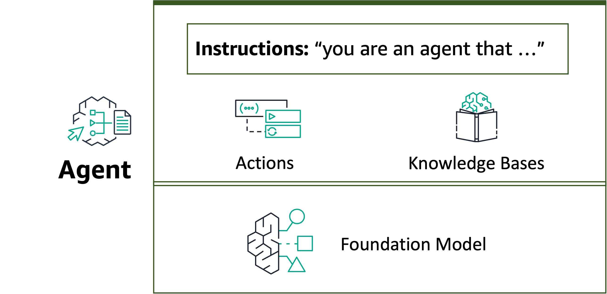

In build-time, all these components are gathered to construct base prompts for the agent in order to carry out orchestration until the user request is completed. With advanced prompts, you can modify these base prompts with additional logic and few-shot examples to improve accuracy for each step of agent invocation. The base prompt templates contain instructions, action descriptions, knowledge base descriptions, and conversation history, all of which you can customize to modify the agent to the best of your needs. You then prepare your agent, which packages all the components of the agents, including security configurations, and brings the agent into a state where it is ready for testing in runtime.

## Lab Overview

Overview
This lab will demonstrate how to create your first agent for Bedrock using the AWS console. It demonstrates how to:

* Select the underlying foundation model (FM) for your agent
* Provide a clear and concise agent instruction
* Create an action group with an API Schema and a Lambda function
* Test and deploy your agent

### Use Cases

Agents can be used in a diverse set of use cases. From the simplest instruction only agent to complex assistants that combine Action Groups with Knowledge Bases, you can use the power of agents to quickly develop your Generative API application.

This workshop uses an insurance claims use case to build our Agent. The agent helps the insurance provider checking the open claims, identifying the details for a specific claim, get open documents for a claim and send reminders for a claim policyholder. The following diagram illustrates the sample process flow.

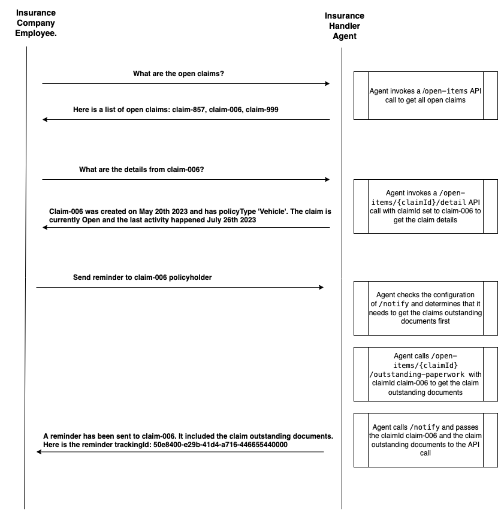

### Architecture

This is the high level architecture

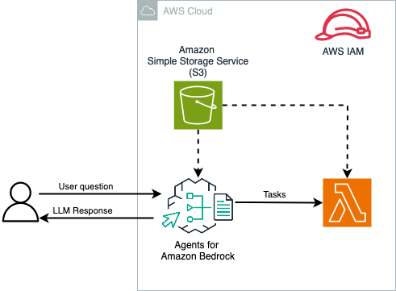

1. You can create an agent with Bedrock-supported FMs such as Anthropic Claude .

2. Attach API schema, residing in an Amazon Simple Storage Service (Amazon S3)  bucket, and a Lambda function containing the business logic to the agent.

3. The agent uses customer requests to create a prompt using the ReAct framework. It, then, uses the API schema to invoke corresponding code in the Lambda function.

4. You can perform a variety of tasks including sending email notifications, writing to databases, triggering application APIs in the Lambda functions.

## Agents for Bedrock Setup
### Prerequisites

To implement the solution provided in this workshop, you should have an AWS account  and access to Amazon Bedrock and the Foundation Model used for your agent. We will demonstrate the functionality using Anthropic Claude V2. Before starting, ensure that you have the model enabled on Bedrock's Model Access  page.

### Setting up Action Group
Before you create your agent, you should set up action groups and knowledge bases that you want to add to your agent.

Action groups define the tasks that you want your agent to help customers carry out.

Knowledge bases provide a repository of information that the agent can query to answer customer queries and improve its generated responses. For more information, see Knowledge base for Amazon Bedrock.

An action group consists of the following components that you set up.

An OpenAPI schema that define the APIs that your action group should call. Your agent uses the API schema to determine the fields it needs to elicit from the customer to populate for the API request.

A Lambda function that defines the business logic for the action that your agent will carry out.

### Creating OpenAPI Schema file
When you create an action group, you must define the APIs that the agent can invoke with an OpenAPI schema in JSON or YAML format. You can create OpenAPI schema files yourself and upload them to Amazon S3 buckets, or you can use the OpenAPI text editor in order to easily validate your schema. The text editor is available after you create the agent. You can use the text editor when you add an action group to an agent or edit an existing one (for more information, see Manage your agent ).

The following is the general format of an OpenAPI schema for an action group.

```
{
    "openapi": "3.0.0",
    "paths": {
        "/path": {
            "method": {
                "description": "string",
                "operationId": "string",
                "parameters": [ ... ],
                "requestBody": { ... },
                "responses": { ... }
           }
       }
    }
}
```

Minimally, each method requires:

* description – A description of the API operation. Use this field to inform the agent when this API should be called and what it does.

* responses – The properties defined for the operation response are not just used for constructing prompts. They are used for accurately processing the results of an API call, and for determining a proper set of steps for carrying out a task. By knowing the response coming back from one operation, the agent can know that those values can be used as inputs for subsequent steps in the process.

For this use case, you will use the API Schema available in this repo. It consists of 4 paths:

/open-items - Gets the list of all open insurance claims. Returns all claimIds that are open.

/open-items/{claimId}/outstanding-paperwork - Gets the list of pending documents that needs to be uploaded by the policy holder before the claim can be processed. The API takes in only one claim id and returns the list of documents that are pending to be uploaded. This API should be called for each claim id.

/open-items/{claimId}/detail - Gets all details about a specific claim given a claim id.

/notify - Send reminder to the policy holder about pending documents for the open claim. The API takes in only one claim id and its pending documents at a time, sends the reminder and returns the tracking details for the reminder. This API should be called for each claim id you want to send reminders.

## Creating S3 Bucket and storing API schema and SQLite files on it

Next, you need to create a S3 Bucket  to store the API Schema and SQLite files. To do so, first navigate to S3 on your AWS console .

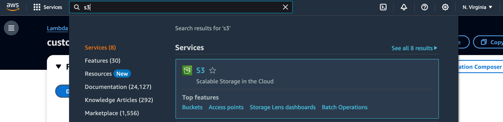

Click on Create bucket and select a unique name for your bucket.

Tip: include your account number and region on the bucket name to ensure it is unique.

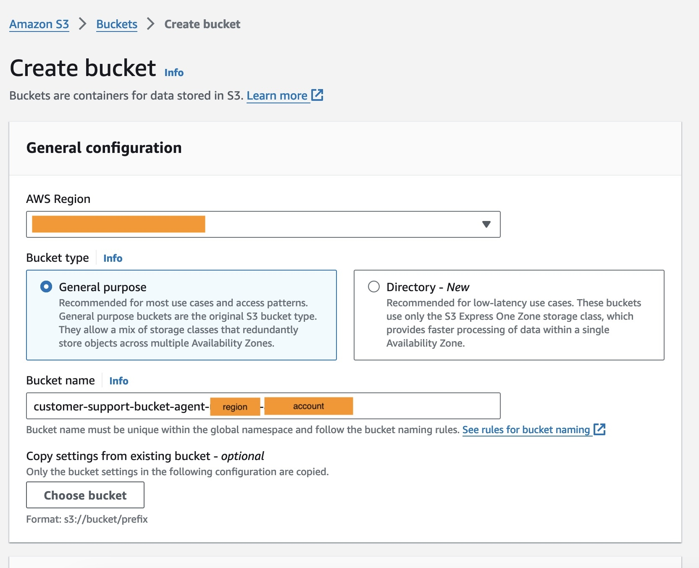

## Save the OpenAPI Schema to your S3 bucket

Creating Action Group Lambda Function
When creating an Action group, you need to define a Lambda function to program the business logic for your action group and to customize how you want the API response to be returned. You use the variables from the input event to define your functions and return a response to the agent. To write your function, you will need to understand the format of the input event and expected response. You must attach a resource-based policy to your Lambda function. For more information about resource-based policies in Lambda, see Using resource-based policies for Lambda .

For the use case, let's use the following code for the Lambda function

```
#!/usr/bin/env python3
# Copyright Amazon.com, Inc. or its affiliates. All Rights Reserved.
# SPDX-License-Identifier: MIT-0
import json


def get_named_parameter(event, name):
    return next(item for item in event['parameters'] if item['name'] == name)['value']


def get_named_property(event, name):
    return next(
        item for item in
        event['requestBody']['content']['application/json']['properties']
        if item['name'] == name)['value']


def claim_detail(payload):
    claim_id = payload['parameters'][0]['value']
    if claim_id == 'claim-857':
        return {
            "response": {
                "claimId": claim_id,
                "createdDate": "21-Jul-2023",
                "lastActivityDate": "25-Jul-2023",
                "status": "Open",
                "policyType": "Vehicle"
            }
        }
    elif claim_id == 'claim-006':
        return {
            "response": {
                "claimId": claim_id,
                "createdDate": "20-May-2023",
                "lastActivityDate": "23-Jul-2023",
                "status": "Open",
                "policyType": "Vehicle"
            }
        }
    elif claim_id == 'claim-999':
        return {
            "response": {
                "claimId": claim_id,
                "createdDate": "10-Jan-2023",
                "lastActivityDate": "31-Feb-2023",
                "status": "Completed",
                "policyType": "Disability"
            }
        }
    else:
        return {
            "response": {
                "claimId": claim_id,
                "createdDate": "18-Apr-2023",
                "lastActivityDate": "20-Apr-2023",
                "status": "Open",
                "policyType": "Vehicle"
            }
        }


def open_claims():
    return {
        "response": [
            {
                "claimId": "claim-006",
                "policyHolderId": "A945684",
                "claimStatus": "Open"
            },
            {
                "claimId": "claim-857",
                "policyHolderId": "A645987",
                "claimStatus": "Open"
            },
            {
                "claimId": "claim-334",
                "policyHolderId": "A987654",
                "claimStatus": "Open"
            }
        ]
    }


def outstanding_paperwork(parameters):
    for parameter in parameters:
        if parameter.get("value", None) == "claim-857":
            return {
                "response": {
                    "pendingDocuments": "DriverLicense, VehicleRegistration"
                }
            }
        elif parameter.get("value", None) == "claim-006":
            return {
                "response": {
                    "pendingDocuments": "AccidentImages"
                }
            }
        else:
            return {
                "response": {
                    "pendingDocuments": ""
                }
            }


def send_reminder(payload):
    print(payload)
    return {
        "response": {
            "sendReminderTrackingId": "50e8400-e29b-41d4-a716-446655440000",
            "sendReminderStatus": "InProgress"
        }
    }


def lambda_handler(event, context):
    action = event['actionGroup']
    api_path = event['apiPath']

    if api_path == '/open-items':
        body = open_claims()
    elif api_path == '/open-items/{claimId}/outstanding-paperwork':
        parameters = event['parameters']
        body = outstanding_paperwork(parameters)
    elif api_path == '/open-items/{claimId}/detail':
        body = claim_detail(event)
    elif api_path == '/notify':
        body = send_reminder(event)
    else:
        body = {"{}::{} is not a valid api, try another one.".format(action, api_path)}

    response_body = {
        'application/json': {
            'body': str(body)
        }
    }

    action_response = {
        'actionGroup': event['actionGroup'],
        'apiPath': event['apiPath'],
        'httpMethod': event['httpMethod'],
        'httpStatusCode': 200,
        'responseBody': response_body
    }

    response = {'response': action_response}
    return response

```

This function uses a sqlite database that will be stored in your S3 bucket. We will copy the files to a newly created bucket in the next step.

To create the Lambda function via AWS console, open your console and navigate to Lambda function

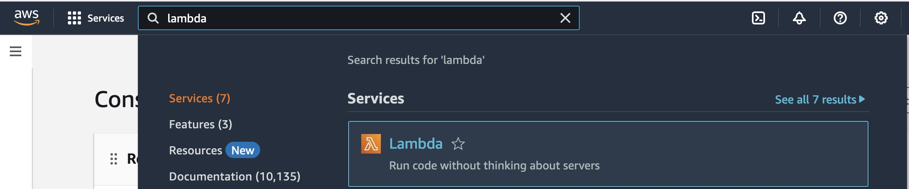

Create a new Lambda function with Python 3.12 as runtime language

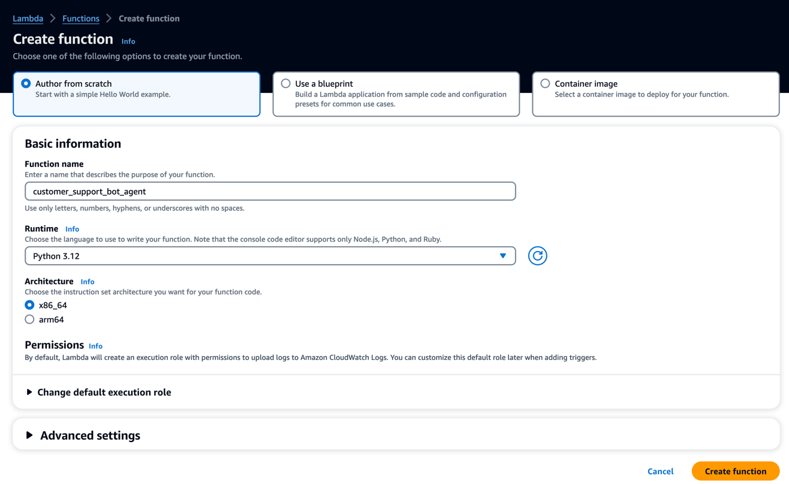

Replace the function code with the code provided above and deploy the changes

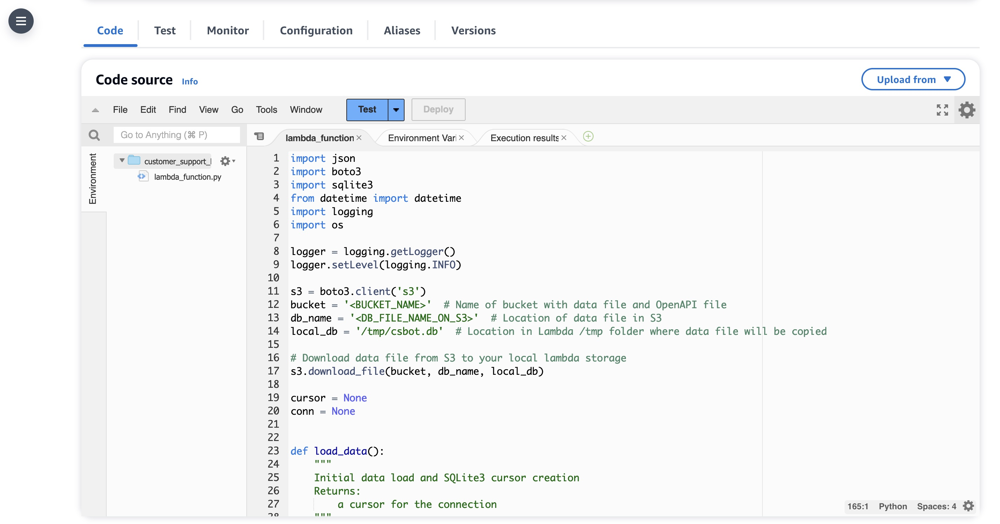

## Creating agent for Bedrock

Now that you have all the pre-requisites in place, let's create the Bedrock agent. To do so, first navigate to Bedrock on your AWS console.

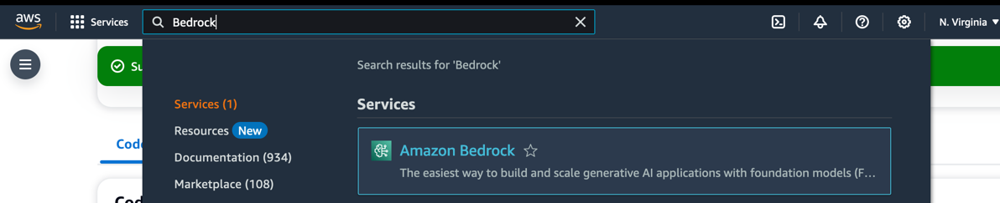

On the left side menu, select Agent and then click on the Create Agent button

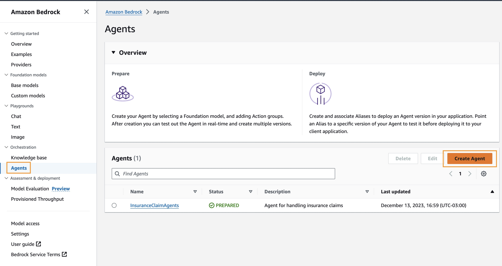

Provide a name and a description to your agent. Use the Create and use a new service role option for your IAM role.

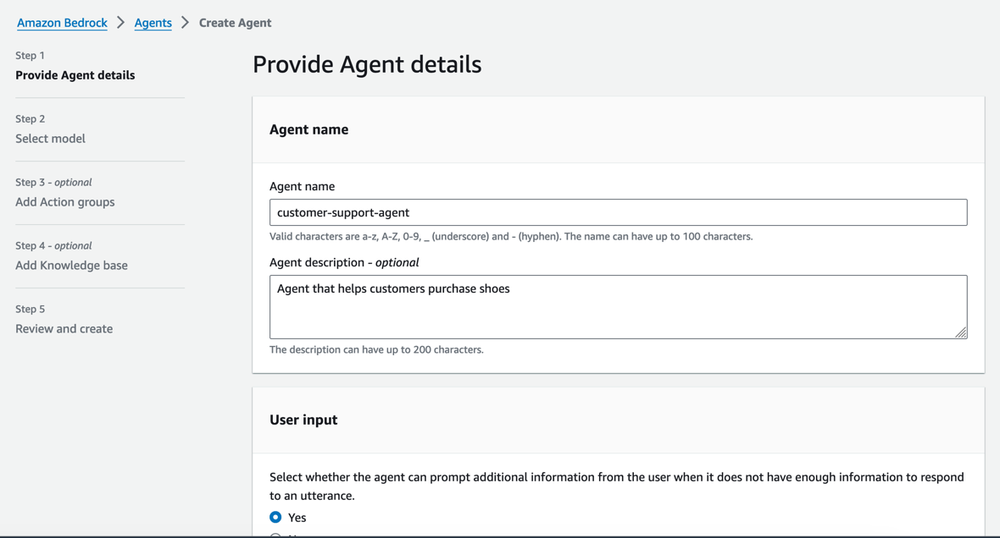

### Setting agent's instructions

We now need to set clear and specific instructions for the task the agent will perform. Copy the following text on your instructions field and select Claude V2 or Claude V2.1 as your foundation model

```
You are an agent that can handle various tasks related to insurance claims, including looking up claim 
details, finding what paperwork is outstanding, and sending reminders. Only send reminders if you have been 
explicitly requested to do so. If an user asks about your functionality, provide guidance in natural language 
and do not include function names on the output.
```

### Creating agent's Action Group

Go back to the lambda function


To create the Action Group that connects the Lambda function and OpenAPI schema created before. You should also set a description for your Action Group that informs the agent about the functionalities available. Copy the following text on the description field:

```
Actions for listing claims, identifying missing paperwork, sending reminders
```

As you are not adding a Knowledge Base at the moment, you can skip this step and create your agent.

### Setting Lambda's permissions

Add resource-based policy for Bedrock to invoke the model. In the Lambda function go to Configuration/Permissions and scroll down to Resource-based policy statements and click on Add permissions

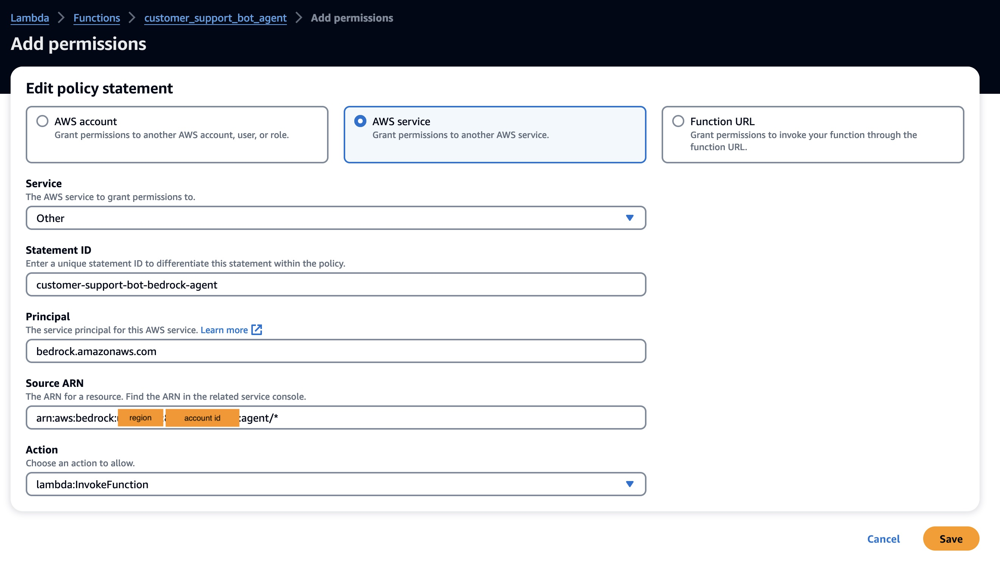

Set principal to bedrock.amazonaws.com and source ARN to arn:aws:bedrock:<REGION>:<ACCOUNT_NUMBER>:agent/* and click on Save to continue

Now you need to allow your Lambda function to access S3 location containing the database file. To do so, navigate to the Lambda IAM role and add attach the AmazonS3FullAccess policy

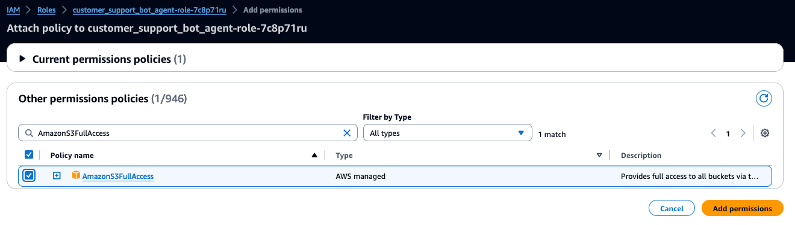

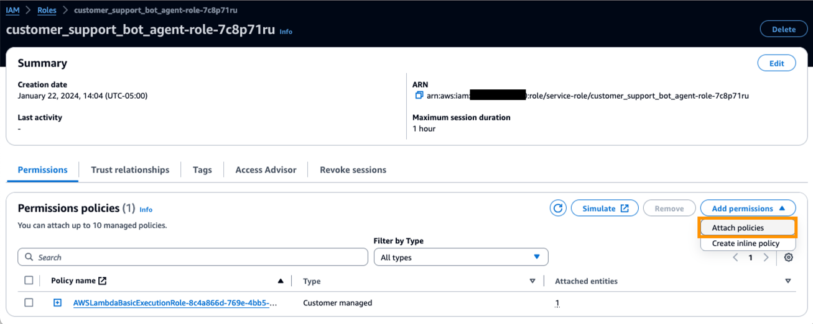


### Testing agent

Now that you've created your first agent, it is time to test it. When you first create an agent, you will have a working draft version and a TestAlias alias that points to it. The working draft is a version of the agent that you can use to iteratively build the agent. By default, you can interact with the working draft with the TestAlias, You can also select a different alias to test. In the test window, you can choose to show the trace for each response. The trace shows the agent's reasoning process, step-by-step, and is a useful tool for debugging your agent. To learn more about the trace, see Trace events .

To understand the agent's reasoning you can use the Show trace > link

You can now update your agent instruction, OpenAPI Schema and Lambda functions and use the Amazon Bedrock console testing functionalities to test the reactions of your agent.

### Deploying agent

After you have sufficiently iterated on your working draft and are satisfied with the behavior of your agent, you can set it up for deployment and integration into your application by creating aliases of your agent.

To deploy your agent, you need to create an alias. During alias creation, Amazon Bedrock automatically creates a version of your agent. The alias points to this newly created version. You can point the alias to a previously created version if necessary. You then configure your application to make API calls to that alias.

The version is a snapshot that preserves the resource as it exists at the time it was created. We can keep modifying the working draft and create new aliases (and consequently, versions) of your agent as necessary. In Amazon Bedrock, you create a new version of your agent by creating an alias that points to the new version by default. Amazon Bedrock creates versions in numerical order, starting from 1. Because a version acts as a snapshot of your agent at the time you created it, it is immutable.

Aliases let you efficiently switch between different versions of your agent without requiring the application to keep track of the version. For example, you can change an alias to point to a previous version of your agent if there are changes that you need to quickly revert.

The working draft version is DRAFT and the alias that points to it is the TestAlias.

To create a new Alias, you need to navigate to the agent page and click on the Create Alias button.

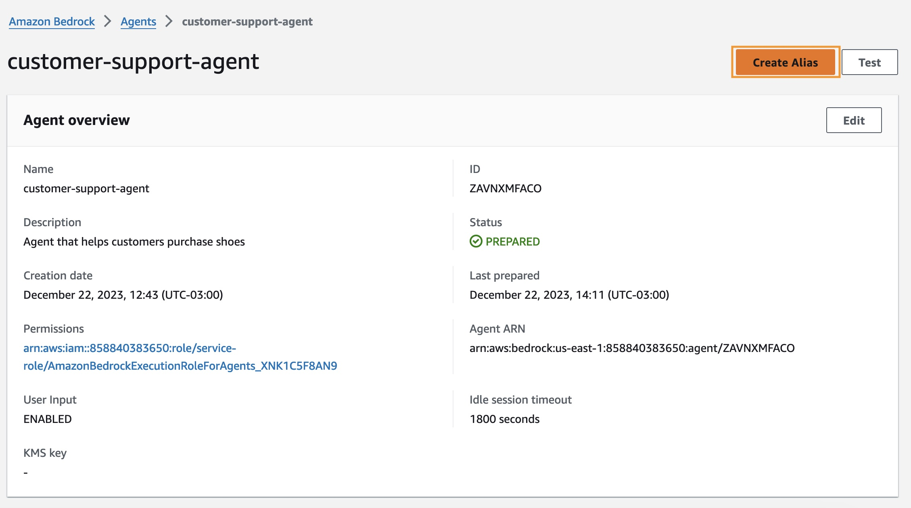


You can now invoke the agent using the Invoke Agent  API with the new Alias. The following code provides an example of agent invocation

```
import boto3
import uuid

# create a boto3 bedrock agent client
client = boto3.client("bedrock-agent-runtime")

# invoke the agent API
response = client.invoke_agent(
    inputText="Tell me about claim-857",
    agentId="<AGENT_ID>",
    agentAliasId="<AGENT_ALIAS>",
    sessionId=str(uuid.uuid1()), # random identifier,
    enableTrace=True
)

print(response)
```

### Conclusion

Agents for Amazon Bedrock can help you increase productivity, improve your customer service experience, or automate DevOps tasks. This workshop showed you how to set up agents for Amazon Bedrock to create a customer service bot.

We encourage you to learn more by reviewing the User Guide  of agents for Bedrock. You can use the example code provided in this workshop to start creating your implementation